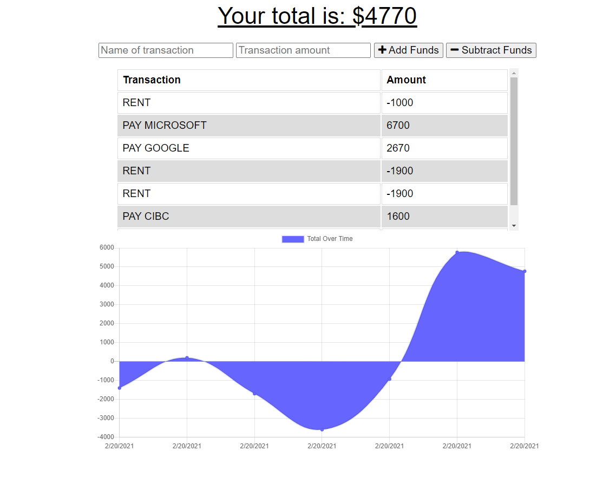

  # Budget Tracker

  

  ## Description 
  This application allows users to track their transactions, store it in a database and display it graphically. This applicated supports offline work, storing data into indexdb to be uploaded once the user reconnects.

  ## Screenshots
  

  ## Live site
  https://agile-mountain-15348.herokuapp.com/

  ## Table of Contents:
  * [Installation](#installation)
  * [Usage](#usage)
  * [License](#license)
  * [Contributing](#contributing)
  * [Questions](#questions)
  and so forth

  ## Installation:
  npm install

  ## Usage:
  node server

  ## License:
  This project is licensed under MIT, click the badge to learn more.

  ## Contributing:
  [ckzard](https://www.github.com/ckzard)

  ## Questions
  For any questions regarding this project please email me at:
  ckzard@gmail.com

